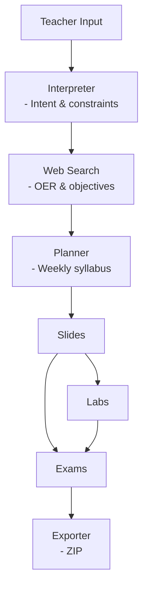

## منهاج - minhaj

## 1. Teacher Input

### Purpose

The Teacher Input is the **entry point of the system**. It captures the instructor’s instructional intent in natural language.

### Example
* Free-text description (e.g., topic, level, duration, learning goals, constraints)
> “Create a 6-week introductory Java programming course with slides and practical labs for first-year undergraduates.”

### Output

Raw, unstructured text passed to the **Interpreter Agent**.

---

## 2. Interpreter Agent

**(Intent & Constraints Extraction)**

### Purpose

The Interpreter Agent transforms ambiguous human input into a **formal internal requirement representation** that the rest of the system can reliably operate on.

### Core Responsibilities

* Identify instructional intent (subject, scope)
* Extract constraints (duration, level, formats)
* Normalize terminology (e.g., “intro” → beginner)
* Resolve implicit assumptions

### Output (JSON)

* Subject domain
* Educational level
* Duration (weeks/modules)
* Learning goals
* Required outputs (slides, labs, exams)

This JSON format is stored and passed forward.

---

## 3. Web Search & Resource Retrieval Agent

**(OER & Learning Objectives)**

### Purpose

This agent grounds content generation in **real educational practice** by retrieving curriculum-level signals from web sources.

### What It Accesses

* University course syllabi (e.g. stanford, MIT, ...etc)
* MOOC platforms (Massive Open Online Courses) (e.g. Coursera, EDX ...etc) , Tech education websites

### Output

A set of **normalized resource objects, Topic sequences based on Academic level indicators with search limit (3 sources)**, each containing:

* Topics
* Learning outcomes
* Course structure patterns
* Domain-specific technical coverage, such as:
* * Core concepts and techniques
* * Algorithms / models (e.g., for ML: regression, trees, neural networks)
* * Frameworks, libraries, or tools commonly used at that level
* Source metadata

---

## 4. Planner Agent

**(Weekly Syllabus Generation)**

### Purpose

The Planner Agent combines teacher requirements and search data to create a clear, time-based syllabus.

### Output

A **weekly syllabus**, including:

* Topics details per week
* Learning outcomes
* content type indicators (slides, labs, exams)

This syllabus becomes the blueprint for all content generation agents.

---

## 5. Slides Generation Agent

### Purpose

The Slides Agent generate the syllabus into into **ready-to-teach instructional presentations**.

### Input

* Weekly syllabus 

### Responsibilities

* Generate structured slide content
* Align explanations with outcomes
* Output in teacher-editable formats (e.g., QMD)

### Output

* One presentation per week/module
* Clear learning objectives
* Concept explanations
* Examples

---

## 6. Labs Generation Agent

### Purpose

The Labs Agent produces **hands-on practical activities** aligned with syllabus outcomes.

### Input

* slides content
* Required programming languages if available 

### Responsibilities

* Design lab tasks
* Provide code and instructions
* Encourage active learning
* Support multiple languages/formats (Python, Java, notebooks)

### Output

* Executable lab files (e.g., `.ipynb`, `.py`, `.java`)
* Clear objectives and steps
* Exercises tied directly to outcomes

---

## 7. Exam Generation Agent

### Purpose

The Exams Agent creates **assessment materials**.

### Input

* Learning outcomes
* slides, labs

### Responsibilities

* Generate conceptual questions
* Create applied problem-solving tasks
* Balance difficulty and coverage
* Avoid solution leakage

### Output

* word processors files

---

## 8. Exporter Agent

**(ZIP)**

### Purpose

The Exporter Agent packages all generated artifacts into a **.zip format**.

### Responsibilities

* Organize files into a clear directory structure
* Export all content as a single ZIP archive

### Output Structure

* Syllabus
* Slides
* Labs
* Exams

