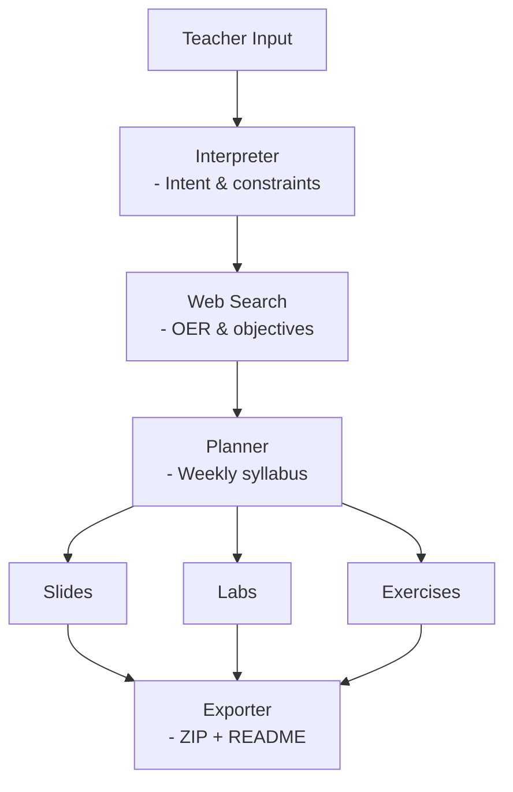

## منهاج - minhaj

```mermaid
graph TD;
    A[Teacher Input] --> B[Interpreter<br/>- Intent & constraints];
    B --> C[Web Search<br/>- OER & objectives];
    C --> D[Planner<br/>- Weekly syllabus];
    D --> E[Slides];
    D --> F[Labs];
    D --> G[Exercises];
    E --> H[Exporter<br/>- ZIP + README];
    F --> H;
    G --> H;
```
