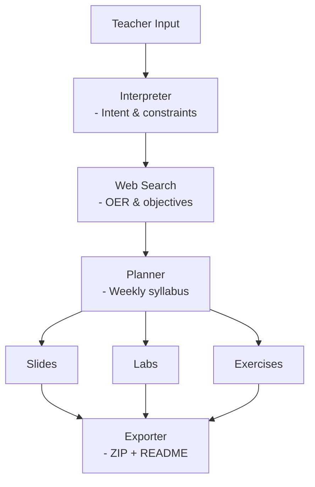

## منهاج - minhaj

## 1. Teacher Input

### Purpose

The Teacher Input is the **entry point of the system**. It captures the instructor’s instructional intent in natural language without forcing them to understand technical or pedagogical formalisms.

### Input Characteristics

* Free-text description (e.g., topic, level, duration)
* Optional constraints (language, format, assessment type)
* Pedagogical preferences (labs vs theory, difficulty)

### Example

> “Create a 6-week introductory Java programming course with slides and practical labs for first-year undergraduates.”

### Output

Raw, unstructured text passed to the **Interpreter Agent**.

---

## 2. Interpreter Agent

**(Intent & Constraints Extraction)**

### Purpose

The Interpreter Agent transforms ambiguous human input into a **formal internal requirement representation** that the rest of the system can reliably operate on.

### Core Responsibilities

* Identify instructional intent (subject, scope)
* Extract constraints (duration, level, formats)
* Normalize terminology (e.g., “intro” → beginner)
* Resolve implicit assumptions

### Output (JSON)

* Subject domain
* Educational level
* Duration (weeks/modules)
* Learning goals
* Required outputs (slides, labs, exams)

This JSON format is stored and passed forward.

---

## 3. Web Search & Resource Retrieval Agent

**(OER & Learning Objectives)**

### Purpose

This agent grounds content generation in **real educational practice** by retrieving curriculum-level signals from web sources.

### What It Accesses

* University course syllabi
* Open Educational Resources (OER)
* Public curricula and frameworks
* MOOC platforms (Massive Open Online Courses) , Tech education websites, Online course marketplaces

### What It Extracts

* Learning objectives
* Topic sequences
* Academic level indicators
  
### Output

A set of **normalized resource objects**, each containing:

* Topics
* Learning outcomes
* Course structure patterns
* Source metadata

---

## 4. Planner Agent

**(Weekly Syllabus Generation)**

### Purpose

The Planner Agent synthesizes teacher requirements and retrieved educational signals into a **coherent, time-structured syllabus**.

### Core Reasoning Tasks
xxxxxxxxxxxxxxxxxxxxxxxxxxxxxxxxxxxxxxxxxxxxxxxxxxxxxxxxxxxxxxxxxxxxxx
* Align learning objectives across sources
* Sequence topics logically (prerequisites first)
* Distribute content across weeks/modules
* Match assessments to outcomes

### Pedagogical Logic

* Cognitive load balancing
* Progressive skill development
* Outcome-driven structure

### Output

A **weekly syllabus**, including:

* Topics per week
* Learning outcomes
* Planned instructional activities
* Assessment type indicators

This syllabus becomes the blueprint for all content generation agents.

---

## 5. Slides Generation Agent

### Purpose

The Slides Agent converts the syllabus into **ready-to-teach instructional presentations**.

### Input

* Weekly syllabus structure
* Learning outcomes per week
* Topic descriptions

### Responsibilities

* Generate structured slide content
* Align explanations with outcomes
* Maintain pedagogical flow
* Output in teacher-editable formats (e.g., QMD)

### Output

* One slide deck per week/module
* Clear learning objectives
* Concept explanations
* Examples and summaries

Slides are instructional artifacts, not lecture scripts.

---

## 6. Labs Generation Agent

### Purpose

The Labs Agent produces **hands-on practical activities** aligned with syllabus outcomes.

### Input

* Weekly topics
* Required programming languages
* Skill level constraints

### Responsibilities

* Design scaffolded lab tasks
* Provide starter code and instructions
* Encourage active learning
* Support multiple languages/formats (Python, Java, notebooks)

### Output

* Executable lab files (e.g., `.ipynb`, `.py`, `.java`)
* Clear objectives and steps
* Exercises tied directly to outcomes

Labs reinforce applied understanding.

---

## 7. Exercises Generation Agent

### Purpose

The Exercises Agent creates **practice and assessment materials** to consolidate learning.

### Input

* Learning outcomes
* Topic difficulty
* Assessment preferences

### Responsibilities

* Generate conceptual questions
* Create applied problem-solving tasks
* Balance difficulty and coverage
* Avoid solution leakage

### Output

* Practice exercises
* Homework-style problems
* Optional challenge tasks

Exercises support reinforcement and evaluation.

---

## 8. Exporter Agent

**(ZIP + README)**

### Purpose

The Exporter Agent packages all generated artifacts into a **teacher-ready delivery format**.

### Responsibilities

* Organize files into a clear directory structure
* Generate a README with usage instructions
* Export all content as a single ZIP archive

### Output Structure

* Syllabus
* Slides
* Labs
* Exercises
* README

### Key Design Choice

This agent uses **no AI reasoning**.
It ensures determinism, reliability, and reproducibility.

---

## Architectural Summary

This architecture:

* Separates **intent interpretation**, **knowledge grounding**, and **content creation**
* Uses multi-agent specialization for clarity and scalability
* Produces original, explainable, and reusable educational materials
* Keeps teachers in control while automating heavy instructional design work

If you want, I can next:

* Convert this into a **formal architecture diagram description**
* Rewrite it as a **Methodology or System Architecture chapter**
* Add a **validation or quality-assurance agent**

Just tell me.
