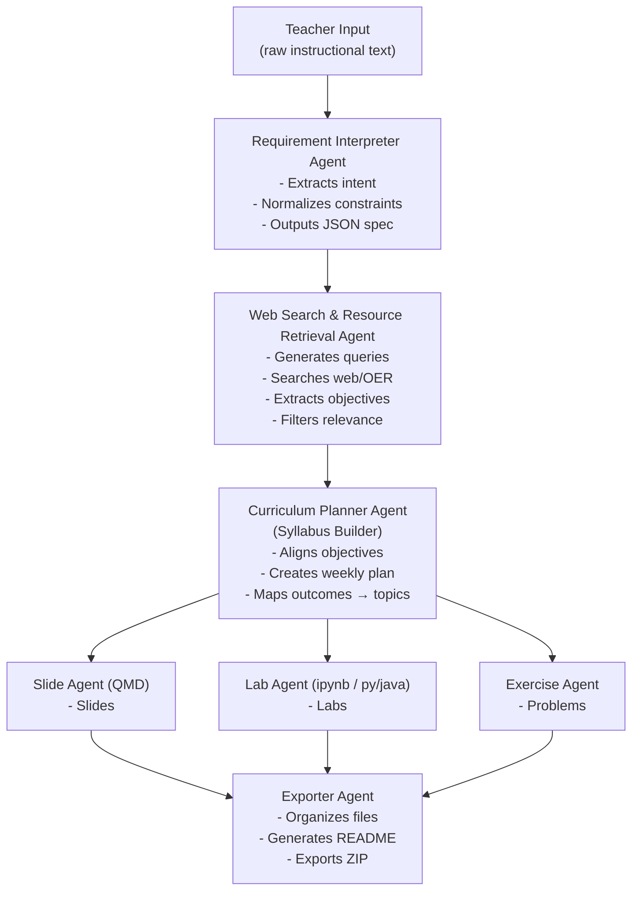

## منهاج - minhaj

┌────────────────────────────┐

│        Teacher Input       │

│  (raw instructional text)  │

└─────────────┬──────────────┘

              │
              
              ▼
              
┌────────────────────────────┐
│ Requirement Interpreter    │
│ Agent                      │
│ - Extracts intent          │
│ - Normalizes constraints   │
│ - Outputs JSON spec        │
└─────────────┬──────────────┘
              │
              ▼
┌────────────────────────────┐
│ Web Search & Resource      │
│ Retrieval Agent            │
│ - Generates queries        │
│ - Searches web / OER       │
│ - Extracts objectives      │
│ - Filters relevance        │
└─────────────┬──────────────┘
              │
              ▼
┌────────────────────────────┐
│ Curriculum Planner Agent   │
│ (Syllabus Builder)         │
│ - Aligns objectives        │
│ - Creates weekly plan     │
│ - Maps outcomes → topics  │
└─────────────┬──────────────┘
              │
      ┌───────┴────────┬─────────────┐
      ▼                ▼             ▼
┌──────────────┐ ┌──────────────┐ ┌──────────────┐
│ Slide Agent  │ │ Lab Agent    │ │ Exercise     │
│ (QMD)        │ │ (ipynb /     │ │ Agent        │
│              │ │  py / java) │ │              │
│ - Slides     │ │ - Labs       │ │ - Problems   │
└──────┬───────┘ └──────┬───────┘ └──────┬───────┘
       │                │                │
       └──────────┬─────┴─────┬──────────┘
                  ▼           ▼
          ┌────────────────────────────┐
          │ Exporter Agent              │
          │ - Organizes files           │
          │ - Generates README          │
          │ - Exports ZIP               │
          └────────────────────────────┘
